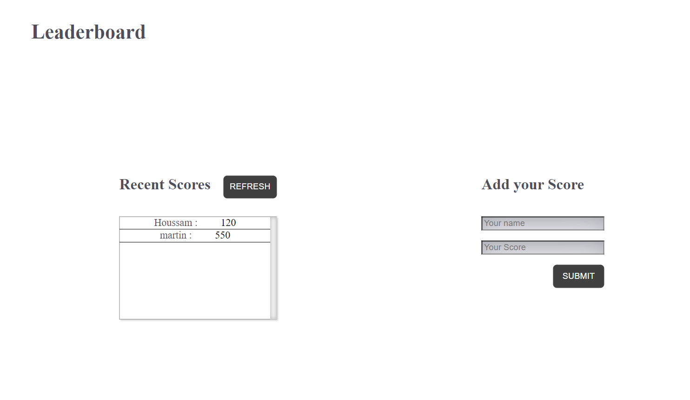

# Leaderboard

# Leaderboard

The leaderboard website displays scores submitted by different players. It also allows you to submit your score. All data is preserved thanks to the external Leaderboard API service.

## Built With

- HTML5
- CSS3
- Webpack
- JavaScript

<!-- ## Live Demo

[Live Demo Link](https://redwing555.github.io/todo-list/) -->

## Getting Started

To get a local copy up and running follow these simple steps.

- Clone using SSH git@github.com:redwing555/leaderboard.git
- Clone using https https://github.com/redwing555/leaderboard.git

and run `npm install`

### Install

to build a the project into `./dist` folder run

`npm run build`

### Usage

to start the webpack-dev-server run

`npm run serve`

## Authors

👤 **Redwing555**

- GitHub: [@redwing555](https://github.com/redwing555)

## 🤝 Contributing

Contributions, issues, and feature requests are welcome!

Feel free to check the [issues page](../../issues/).

## Show your support

Give a ⭐️ if you like this project!

## Acknowledgments

- Hat tip to anyone whose code was used
- Inspiration
- etc

## 📝 License

This project is [MIT](./MIT.md) licensed.
